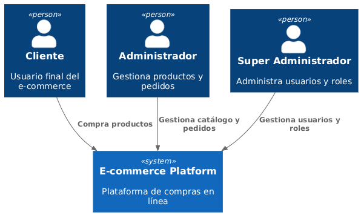
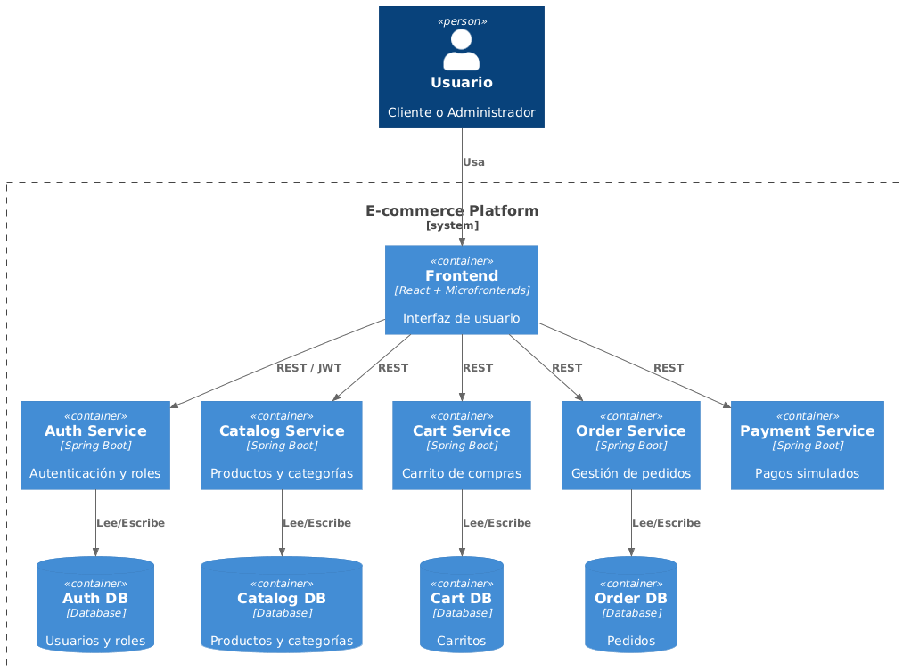

# Arquitectura del Sistema – E-commerce

## 📌 Introducción

Este documento describe la **arquitectura de alto nivel** del proyecto **E-commerce**, diseñada como parte del MVP con el objetivo de demostrar buenas prácticas de diseño de software, separación de responsabilidades y escalabilidad.

La arquitectura se apoya en:

* **Microservicios** para el backend
* **Microfrontends** para el frontend
* **Arquitectura Hexagonal** en cada microservicio
* Comunicación mediante **APIs REST** documentadas con OpenAPI

Para su representación se utiliza el **modelo C4**, enfocado en facilitar la comprensión del sistema a diferentes niveles.

---

## 🧩 Modelo C4

En esta fase del proyecto se cubren los dos primeros niveles del modelo C4:

* **Context Diagram (Nivel 1)**
* **Container Diagram (Nivel 2)**

Los niveles de Component y Code se abordarán en etapas posteriores del desarrollo.

---

## 🌍 Diagrama C4 – Context

### Propósito

El diagrama de contexto muestra el sistema como una **caja negra**, identificando:

* Los tipos de usuarios que interactúan con la plataforma
* El alcance funcional general del sistema
* La ausencia de dependencias externas reales (pagos simulados)

### Actores

* **Cliente**: Usuario final que navega el catálogo, gestiona su carrito y realiza pedidos.
* **Administrador**: Usuario encargado de la gestión de productos, categorías y pedidos.
* **Super Administrador**: Usuario con control total del sistema, incluyendo la gestión de usuarios y roles.

### Sistema

* **E-commerce Platform**: Plataforma central que provee funcionalidades de compra en línea y administración.

### Diagrama

---

## 🧱 Diagrama C4 – Container

### Propósito

El diagrama de contenedores describe cómo el sistema se divide internamente en:

* Aplicaciones frontend
* Microservicios backend
* Bases de datos
* Mecanismos de comunicación

Este nivel permite entender **responsabilidades técnicas** sin entrar aún en detalles de implementación.

---

### Frontend

El frontend está basado en una arquitectura de **microfrontends**, orquestados por una aplicación contenedora (Shell).

Microfrontends incluidos:

* **Auth App**: Autenticación y gestión de sesión
* **Catalog App**: Visualización de productos y categorías
* **Cart App**: Gestión del carrito de compras
* **Orders App**: Consulta de pedidos
* **Admin App**: Gestión administrativa del sistema

---

### Backend

El backend está compuesto por **microservicios independientes**, cada uno implementando arquitectura hexagonal y siendo dueño de su propio dominio y base de datos.

Microservicios:

* **Auth/User Service**
  Gestión de usuarios, roles y autenticación basada en JWT.

* **Catalog Service**
  Gestión de productos y categorías.

* **Cart Service**
  Manejo del carrito de compras por usuario.

* **Order Service**
  Creación y seguimiento de pedidos.

* **Payment Service (Mock)**
  Simulación del proceso de pago sin integración con pasarelas externas.

---

### Persistencia

Cada microservicio cuenta con su **propia base de datos**, garantizando:

* Bajo acoplamiento
* Independencia de despliegue
* Aislamiento de datos

---

### Comunicación

* El frontend se comunica con los microservicios mediante **APIs REST**.
* La autenticación se basa en **JWT**, emitidos por el Auth Service.
* La comunicación entre servicios es síncrona vía HTTP (en el MVP).

---

### Diagrama

---

## 🧠 Decisiones arquitectónicas clave

* Separación total entre frontend y backend
* Un microservicio por dominio de negocio
* Una base de datos por microservicio
* Pagos simulados para evitar dependencias externas
* Arquitectura orientada a escalabilidad y mantenibilidad

---

## 📍 Alcance actual

Esta documentación corresponde al **MVP** del proyecto. No se incluyen en esta fase:

* Integraciones con sistemas externos reales
* Comunicación asíncrona por eventos
* Diagramas de componentes o código

Estos aspectos se incorporarán en iteraciones posteriores.

---

